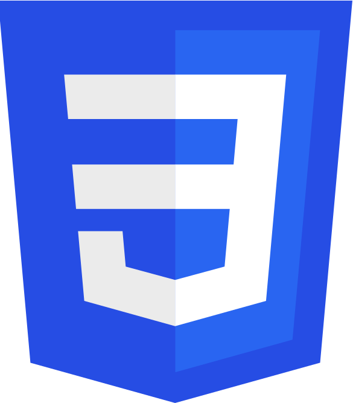

 
 &nbsp;&nbsp; &nbsp;&nbsp; 
 &nbsp;&nbsp;&nbsp;&nbsp; 
&nbsp;&nbsp; &nbsp;&nbsp; 
 &nbsp;&nbsp;&nbsp;&nbsp; 
&nbsp;&nbsp; &nbsp;&nbsp; 
&nbsp;&nbsp; &nbsp;&nbsp; 

<!--  &nbsp;&nbsp; &nbsp;&nbsp; --!>
<!--  &nbsp;&nbsp; &nbsp;&nbsp; --!>

 
 
   

  

 

 
 

### Medium Articles

- [Setting up React Native Vector Icons for IOS](https://semihdurmus.medium.com/setting-up-react-native-vector-icons-for-ios-a5d57e78cdb2)
- [Making a ToDo List with HTML, CSS and Javascript](https://semihdurmus.medium.com/making-a-todo-list-with-html-css-and-javascript-154839b770b6)

